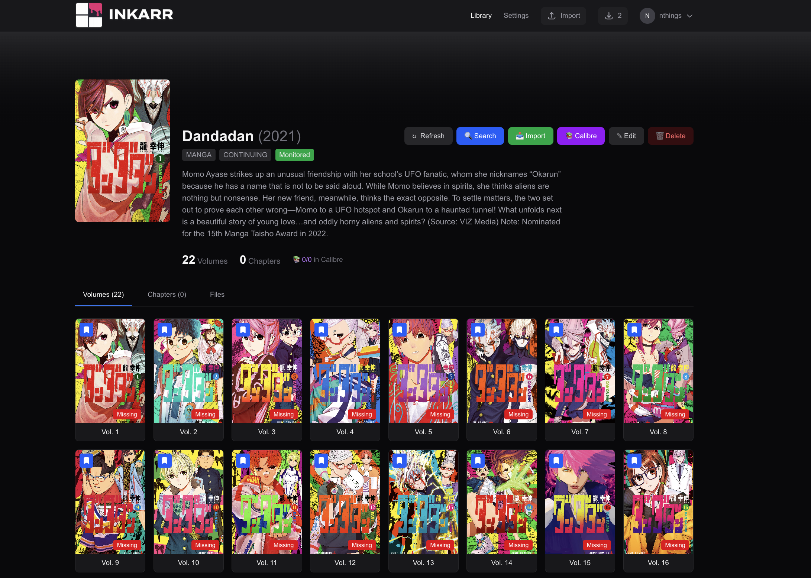

<div align="center">


### The PVR for Comic and Manga Enthusiasts


</div>

Inkarr is an automated comic and manga collection manager that follows the philosophy of the "Servarr" ecosystem (Radarr, Sonarr, Readarr). It allows you to track your favorite graphic novels and tankōbon volumes, ensuring your library is always up-to-date with the highest quality releases.



---

## ✨ Key Features

- **Automated Tracking** — Monitor your favorite series for new issues, chapters, or volumes
- **Smart Metadata** — Integration with ComicVine, AniList, MangaDex for accurate tagging and organization
- **Download Client Support** — Native support for SABnzbd, NZBGet, qBittorrent, Transmission, Deluge, and more
- **Indexer Support** — Newznab and Torznab compatible indexers
- **File Management** — Automatically renames and moves files into a structured library (e.g., `{Series Title} Vol. {Volume} ({Year})`)
- **Format Support** — Handles CBZ, CBR, CB7, PDF, EPUB, MOBI formats
- **Multi-Language Support** — Specifically designed to handle both Western comic formats and Japanese manga release cycles

---

## 🏗️ Tech Stack

- **Framework**: Next.js 16+ (App Router)
- **Database**: SQLite via Prisma ORM
- **Language**: TypeScript
- **Styling**: Tailwind CSS

---

## � Quick Start with Docker

The recommended way to deploy Inkarr is with Docker:

```bash
# Clone and deploy
git clone https://github.com/yourusername/inkarr.git
cd inkarr
docker-compose up -d
```

The app will be available at http://localhost:3000

### Docker Compose Configuration

> Pre-built Docker images are published to [GitHub Container Registry](https://github.com/nthings/inkarr/pkgs/container/inkarr) for easy deployment without building locally.

```yaml
services:
  inkarr:
    image: ghcr.io/nthings/inkarr:latest  # Published image on GitHub Container Registry
    container_name: inkarr
    restart: unless-stopped
    ports:
      - "3000:3000"
    volumes:
      - inkarr-data:/app/data
      - ./data/manga:/app/data/manga
      - ./data/comics:/app/data/comics
      - ./data/downloads:/app/data/downloads
    environment:
      - NODE_ENV=production
      - DATABASE_URL=file:/app/data/inkarr.db
    healthcheck:
      test: ["CMD", "wget", "--no-verbose", "--tries=1", "--spider", "http://localhost:3000/api/v1/system/status"]
      interval: 30s
      timeout: 10s
      retries: 3

volumes:
  inkarr-data:
```

---

## 🚀 Development

For local development with pnpm:

### Prerequisites

- Node.js 20+
- pnpm (recommended) or npm

### Setup

```bash
# Clone the repository
git clone https://github.com/yourusername/inkarr.git
cd inkarr

# Install dependencies
pnpm install

# Copy environment file
cp .env.example .env

# Configure your API keys in .env
# - COMICVINE_API_KEY (from https://comicvine.gamespot.com/api/)

# Generate Prisma client and create database
pnpm db:generate
pnpm db:push

# Start development server
pnpm dev
```

The app will be available at http://localhost:3000

### Available Scripts

```bash
pnpm dev          # Start development server
pnpm build        # Build for production
pnpm start        # Start production server
pnpm db:generate  # Generate Prisma client
pnpm db:push      # Push schema to database
pnpm db:migrate   # Run migrations
pnpm db:studio    # Open Prisma Studio
```

### First Run

On first startup, the app will:
1. Initialize the SQLite database at `/data/dev.db`
2. Load default configuration
3. Start the scheduler for automated tasks (refresh series, scan downloads, etc.)

Access the interactive API documentation at http://localhost:3000/docs after startup.

---

## 📡 API Documentation

Comprehensive API documentation is available at:

- **Interactive Swagger UI**: http://localhost:3000/docs
- **OpenAPI Specification**: http://localhost:3000/api/docs

All endpoints are RESTful APIs with JSON request/response bodies.

---

## 🤝 Contributing

Contributions are welcome! Please see our [Contribution Guidelines](CONTRIBUTING.md) to get started.

---

## 📝 License

This project is licensed under the [MIT License](LICENSE.md).